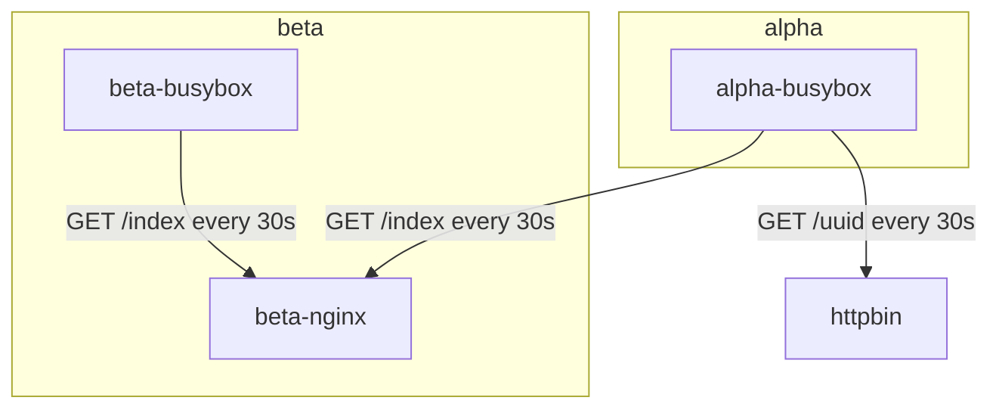

# k8s-network-profiles

Simple deploymnet for testing Kuberenets Network policies.

## Setup

```mermaid
flowchart TD
    alpha-busybox-- GET /uuid every 30s -->httpbin
    subgraph alpha
        alpha-busybox
    end
    subgraph beta
        alpha-busybox-- GET /index every 30s -->beta-nginx
        beta-busybox-- GET /index every 30s -->beta-nginx
    end
```