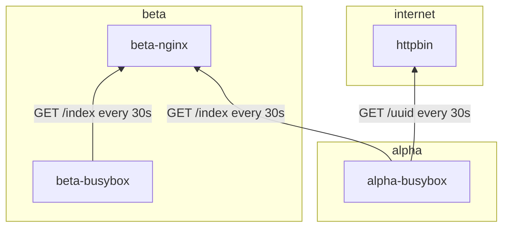

# k8s-network-profiles

Simple deployment for testing Kubernetes [Network policies](https://kubernetes.io/docs/concepts/services-networking/network-policies/).

## Scenario

The diagram shows the test scenarion which is used to establish the network profiles. That are the only connections which should be allowed.

Deployments are split into to two namespaces: `alpha` and `beta`.