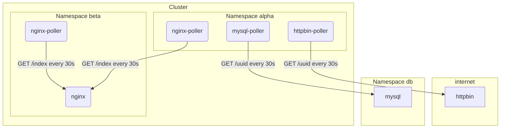

# k8s-network-profiles

Simple deployment for testing Kubernetes [Network policies](https://kubernetes.io/docs/concepts/services-networking/network-policies/).

## Scenario

The diagram shows the test scenarion which is used to establish the network profiles. That are the only connections which should be allowed.

Deployments are splitted into to namespaces: `alpha`, `beta` and `db`.

## Network Policy Editor

To create Network Polices easily, you can use the following online editor: <https://editor.cilium.io/>.
