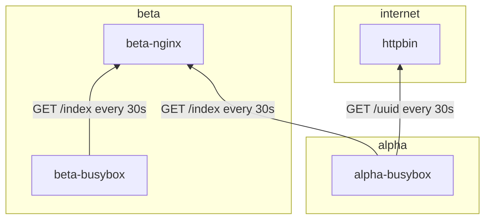

# k8s-network-profiles

Simple deployment for testing Kubernetes Network policies.

## Setup

```mermaid
flowchart BT
    subgraph internet
        httpbin
    end
    subgraph alpha
        alpha-busybox-- GET /uuid every 30s -->httpbin
    end
    subgraph beta
        alpha-busybox-- GET /index every 30s -->beta-nginx
        beta-busybox-- GET /index every 30s -->beta-nginx
    end
```